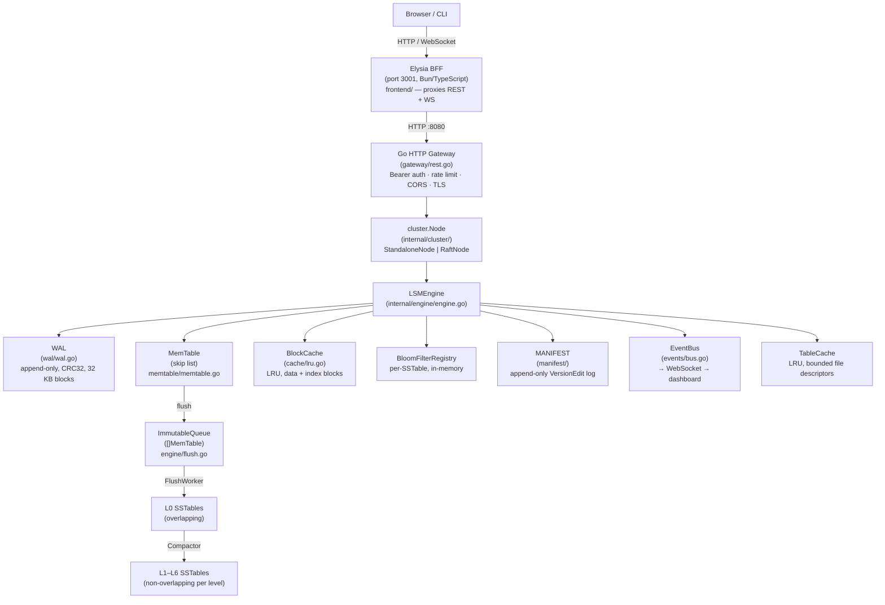

# Architecture Overview

## System diagram

---

## Write path

| Step | Component | Detail |
|------|-----------|--------|
| 1 | `gateway/rest.go` `handlePut` | Validates body size (≤ ~1 MB), authenticates Bearer token |
| 2 | `cluster.Node.Put` | In cluster mode: appends to Raft log, waits for quorum commit |
| 3 | `engine.LSMEngine.Put` | Acquires write lock, assigns seqNo via `WAL.Append` |
| 4 | `wal/wal.go WAL.Append` | Serialises WAL entry, fragments into 32 KB blocks, CRC32-protects each chunk, calls `Sync()` if `SyncWAL=true` |
| 5 | `memtable/memtable.go MemTable.Put` | Inserts `InternalKey{UserKey, SeqNo, TypeValue}` into skip list |
| 6 | `engine/engine.go rotateMemTable` | When `ApproximateSize() >= MemTableSize` (default 64 MB), promotes mutable to immutable queue |
| 7 | `engine/flush.go FlushWorker` | Background goroutine drains immutable queue, calls `SSTableBuilder.Finish()`, writes `EditAddSSTable` to MANIFEST |
| 8 | `compaction/*.go Compactor` | Background goroutine applies the configured strategy when triggers fire |

---

## Read path

| Step | Component | Detail |
|------|-----------|--------|
| 1 | `engine.LSMEngine.Get` | Acquires read lock; snapshot `seqNo = latestSeqNo` |
| 2 | `memtable.MemTable.Get` | O(log n) skip-list lookup; tombstone check |
| 3 | Immutable MemTables | Newest-to-oldest iteration; first hit wins |
| 4 | L0 SSTables | **All** L0 files checked (key ranges may overlap); Bloom filter short-circuits misses |
| 5 | L1–L6 SSTables | Binary search by key range selects exactly one SSTable per level; Bloom filter checked |
| 6 | `sstable/reader.go SSTableReader.Get` | Loads index block (already in memory), fetches data block from `BlockCache` or disk |
| 7 | `cache/lru.go BlockCache.Get` | LRU lookup by `CacheKey{FileID, BlockOffset}`; miss triggers `ReadAt` or mmap read |

---

## Component table

| Component | Package | Role |
|-----------|---------|------|
| WAL | `internal/wal` | Append-only durability log; 32 KB block format; CRC32 per record |
| MemTable | `internal/memtable` | In-memory skip list (MaxLevel=12, P=0.25); mutable → immutable rotation |
| SSTable | `internal/sstable` | Immutable on-disk files: data blocks, filter block, index block, footer |
| MANIFEST | `internal/manifest` | Append-only VersionEdit log; tracks SSTable inventory across levels |
| Compactor | `internal/compaction` | Pluggable: LCS (`leveled.go`), STCS (`stcs.go`), TWCS (`twcs.go`) |
| FlushWorker | `internal/engine/flush.go` | Background goroutine; drains ImmutableQueue → L0 SSTable |
| TableCache | `internal/engine` | Bounded open `SSTableReader` pool; `MaxOpenFiles` file descriptors |
| BlockCache | `internal/cache/lru.go` | LRU block cache; capacity set by `BlockCacheSize` (default 128 MB) |
| BloomFilter | `internal/bloom/bloom.go` | Per-SSTable Bloom filter; k-hash, `BloomBitsPerKey` bits per key |
| Raft / cluster | `internal/cluster` | `RaftNode` for multi-node; `StandaloneNode` for single-node |
| EventBus | `internal/events/bus.go` | Non-blocking fan-out; engine events → WebSocket → dashboard |

---

## Concurrency model

The engine uses a single `sync.RWMutex` (`e.mu`) protecting the mutable MemTable pointer, immutable queue, and MANIFEST version snapshot. Background goroutines run independently:

- **FlushWorker** (`engine/flush.go`): blocks on `immutableReady` channel; acquires `e.mu` write lock only when promoting mutable → immutable and when removing the flushed immutable.
- **Compactor** (`engine/background.go`): wakes on a ticker; reads level metadata under `e.mu.RLock()`, runs the merge outside the lock, and re-acquires `e.mu` only for the MANIFEST `Apply` call.
- **WAL** (`wal/wal.go`): owns its own `sync.Mutex`; write lock held only for the duration of a single `Append` call.
- **BlockCache** (`cache/lru.go`): owns its own `sync.Mutex`; independent from the engine lock.
- **Raft FSM** (`cluster/raft_node.go`): protects engine-swap during snapshot restore with a dedicated mutex separate from `e.mu`.
